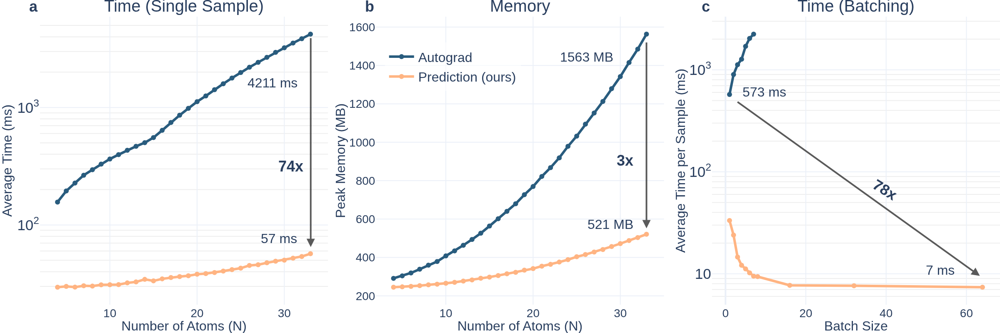

# Molecular Hessians Without Derivatives

A machine learning force field (interactomic potential) to directly predict the Hessian.
Trained on the [HORM Hessian dataset](https://github.com/deepprinciple/HORM), which consists of off-equilibrium geometries of small, neutral organic molecules, contained H, C, N, O, based on the T1x and RGD1 datasets, at the $\omega$B97X/6-31G(d) level of theory.

Compared to autograd Hessians:
- 10-70x faster for a single molecule of 5-30 atoms
- 70x faster for a typical T1x batch in batched prediction
- 3x memory reduction
- Better accuracy (Hessian, Hessian eigenvalues and eigenvectors)
- Better downstream accuracy (relaxation, transition state search, frequency analysis)



## Installation

### Setting up the environment
Install uv (if not already installed)
```bash
curl -LsSf https://astral.sh/uv/install.sh | sh
export PATH="$HOME/.local/bin:$PATH"
```

```bash
git clone git@github.com:BurgerAndreas/hip.git
cd hip

uv venv .venv --python 3.11
source .venv/bin/activate
uv pip install --upgrade pip

uv pip install torch==2.7.0  --index-url https://download.pytorch.org/whl/cu126
uv pip install torch-scatter -f https://data.pyg.org/whl/torch-2.7.0+cu126.html
uv pip install torch-cluster -f https://data.pyg.org/whl/torch-2.7.0+cu126.html
uv pip install torch-geometric

uv pip install -r requirements.txt

uv pip install -e .
```


### Setting up the HORM dataset
Kaggle automatically downloads to the `~/.cache` folder. 
I highly recommend to set up a symbolic link to a local folder to avoid running out of space on your home directory:
```bash
PROJECT = <folder where you want to store the dataset>
mkdir -p ${PROJECT}/.cache
ln -s ${PROJECT}/.cache ${HOME}/.cache
```

Get the HORM dataset: 
```bash
python scripts/download_horm_data_kaggle.py
```

Preprocess the Hessian dataset (takes ~3 hours) 
```bash
python scripts/preprocess_hessian_dataset.py --dataset-file data/sample_100.lmdb

python scripts/preprocess_hessian_dataset.py --dataset-file ts1x-val.lmdb
python scripts/preprocess_hessian_dataset.py --dataset-file RGD1.lmdb
python scripts/preprocess_hessian_dataset.py --dataset-file ts1x_hess_train_big.lmdb
```


## Use our model

Download the checkpoint from HuggingFace
```bash
wget https://huggingface.co/andreasburger/heigen/resolve/main/ckpt/hesspred_v1.ckpt -O ckpt/hesspred_v1.ckpt
```

```python
import os
import torch
from hip.equiformer_torch_calculator import EquiformerTorchCalculator
from hip.equiformer_ase_calculator import EquiformerASECalculator # also try this
from hip.inference_utils import get_dataloader
from hip.frequency_analysis import analyze_frequencies_torch


device = "cuda" if torch.cuda.is_available() else "cpu"

# you might need to change this
project_root = os.path.dirname(os.path.dirname(__file__))
checkpoint_path = os.path.join(project_root, "ckpt/hesspred_v1.ckpt")
calculator = EquiformerTorchCalculator(
    checkpoint_path=checkpoint_path,
    hessian_method="predict",
)

# Example 1: load a dataset file and predict the first batch
dataset_path = os.path.join(project_root, "data/sample_100.lmdb")
dataloader = get_dataloader(
    dataset_path, calculator.potential, batch_size=1, shuffle=False
)
batch = next(iter(dataloader))
results = calculator.predict(batch)
print("\nExample 1:")
print(f"  Energy: {results['energy'].shape}")
print(f"  Forces: {results['forces'].shape}")
print(f"  Hessian: {results['hessian'].shape}")

# Example 2: create a random data object with random positions and predict
n_atoms = 10
elements = torch.tensor([1, 6, 7, 8])  # H, C, N, O
pos = torch.randn(n_atoms, 3)  # (N, 3)
atomic_nums = elements[torch.randint(0, 4, (n_atoms,))]  # (N,)
results = calculator.predict(coords=pos, atomic_nums=atomic_nums)
print("\nExample 2:")
print(f"  Energy: {results['energy'].shape}")
print(f"  Forces: {results['forces'].shape}")
print(f"  Hessian: {results['hessian'].shape}")

print("\nFrequency analysis:")
hessian = results["hessian"]
frequency_analysis = analyze_frequencies_torch(hessian, pos, atomic_nums)
print(f"eigvals: {frequency_analysis['eigvals'].shape}")
print(f"eigvecs: {frequency_analysis['eigvecs'].shape}")
print(f"neg_num: {frequency_analysis['neg_num']}")
print(f"natoms: {frequency_analysis['natoms']}")
```

## Citation

If you found this code useful, please consider citing:
```bibtex
@inproceedings{
burger2025hessians,
title={Molecular Hessians Without Derivatives},
author={Andreas Burger and Luca Thiede and  Nikolaj Rønne and Nandita Vijaykumar and Tejs Vegge and Arghya Bhowmik and Alan Aspuru-Guzik},
booktitle={The Fourteenth International Conference on Learning Representations},
year={2026},
url={https://openreview.net/forum?id=CNLC4ZkLmW}
}
```

The training code and the dataset are based on the HORM [paper](https://arxiv.org/abs/2505.12447), [dataset](https://www.kaggle.com/datasets/yunhonghan/hessian-dataset-for-optimizing-reactive-mliphorm/data), and [code](https://github.com/deepprinciple/HORM)
We thank the authors of from DeepPrinciple for making their code and data openly available. 
```bibtex
@misc{cui2025hormlargescalemolecular,
      title={HORM: A Large Scale Molecular Hessian Database for Optimizing Reactive Machine Learning Interatomic Potentials}, 
      author={Taoyong Cui and Yunhong Han and Haojun Jia and Chenru Duan and Qiyuan Zhao},
      year={2025},
      eprint={2505.12447},
      archivePrefix={arXiv},
      primaryClass={physics.chem-ph},
      url={https://arxiv.org/abs/2505.12447}, 
}
```