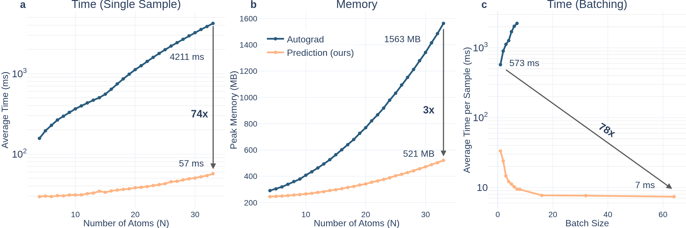

# HIP: Hessian Interatomic Potentials 

Paper: https://arxiv.org/abs/2509.21624 <br>
Official repo: https://github.com/BurgerAndreas/hip <br>
MACE implementation (work in progress): https://github.com/BurgerAndreas/hip-mace <br>

HIPs are machine learning interatomic potentials (MLIPs) that directly predict the Hessian, in addition to the usual energy and forces.
This repo primarily trains HIP-EquiformerV2 on the [HORM Hessian dataset](https://github.com/deepprinciple/HORM), which consists of off-equilibrium geometries of small, neutral organic molecules, contained H, C, N, O, based on Transition1x, at the $\omega$B97X/6-31G(d) level of theory.

Compared to autograd Hessians, HIP is:
- 10-70x faster for a single molecule of 5-30 atoms
- 70x faster for a typical T1x batch in batched prediction
- 3x memory reduction
- Better accuracy (Hessian, Hessian eigenvalues and eigenvectors)
- Better downstream accuracy (relaxation, transition state search, frequency analysis)



## Installation

This should only take 5-10 minutes depending on your internet connection.

### Setting up the environment
First install the uv package manager (if not already installed)
```bash
curl -LsSf https://astral.sh/uv/install.sh | sh
export PATH="$HOME/.local/bin:$PATH"
```

```bash
git clone git@github.com:BurgerAndreas/hip.git
cd hip

# Create virtual environment and install base dependencies
uv venv .venv --python 3.11
source .venv/bin/activate
uv sync

# Install PyTorch with CUDA support
uv pip install torch==2.7.0 --index-url https://download.pytorch.org/whl/cu126

# Install PyTorch Geometric packages with CUDA support
uv pip install torch-scatter -f https://data.pyg.org/whl/torch-2.7.0+cu126.html
uv pip install torch-cluster -f https://data.pyg.org/whl/torch-2.7.0+cu126.html
uv pip install torch-geometric

# Install the package in development mode
uv pip install -e .
```

## Use our model

Download the checkpoint from HuggingFace (222 MB)
```bash
wget https://huggingface.co/andreasburger/heigen/resolve/main/ckpt/hip_v2.ckpt -O ckpt/hip_v2.ckpt
```

Run a few forward passes (should take 30s)
```bash
uv run example.py
```

## Setting up the HORM dataset for training

Our models are trained on the Hessian dataset for Optimizing Reactive MLIP (HORM).

The HORM dataset is hosted on Kaggle.
Kaggle automatically downloads to the `~/.cache` folder. 
If you want to use another location for the files, I recommend to set up a symbolic link to a another folder:
```bash
PROJECT = <folder where you want to store the dataset>
mkdir -p ${PROJECT}/.cache
ln -s ${PROJECT}/.cache ${HOME}/.cache
```

Now download the HORM dataset (25GB): 
```bash
uv run scripts/download_horm_data_kaggle.py
```

Train HIP (around two to three days on a H100 GPU)
```bash
uv run scripts/train.py
```

## Transition state search

For the transition state search we followed the HORM paper and used
- https://github.com/deepprinciple/ReactBench
- https://github.com/deepprinciple/pysisyphus

Unfortunetly, the code is a horrible mess.

If I were to do this project again, I would use (geodesic interpolation + Sella TS search + Sella IRC) as done in this paper: \
https://www.nature.com/articles/s41467-024-52481-5 \
For that you need to install:\
https://github.com/virtualzx-nad/geodesic-interpolate \
https://github.com/zadorlab/sella \
and follow their workflow from here: \
https://github.com/Quantum-Accelerators/quacc/blob/main/src/quacc/recipes/newtonnet/ts.py

## Citation

If I can help you run the code or setup your own project, please email me at: `<firstname>.<lastname>(at)mail.utoronto.ca`

If you found this code useful, please consider citing:
```bibtex
@misc{burger2025hiphessian,
      title={Shoot from the HIP: Hessian Interatomic Potentials without derivatives}, 
      author={Andreas Burger and Luca Thiede and Nikolaj Rønne and Varinia Bernales and Nandita Vijaykumar and Tejs Vegge and Arghya Bhowmik and Alan Aspuru-Guzik},
      year={2025},
      eprint={2509.21624},
      archivePrefix={arXiv},
      primaryClass={cs.LG},
      url={https://arxiv.org/abs/2509.21624}, 
}
```

The dataset and parts of the training code are based on the HORM [paper](https://arxiv.org/abs/2505.12447), [dataset](https://www.kaggle.com/datasets/yunhonghan/hessian-dataset-for-optimizing-reactive-mliphorm/data), and [code](https://github.com/deepprinciple/HORM)
We thank the authors of from DeepPrinciple for making their code and data openly available. 
